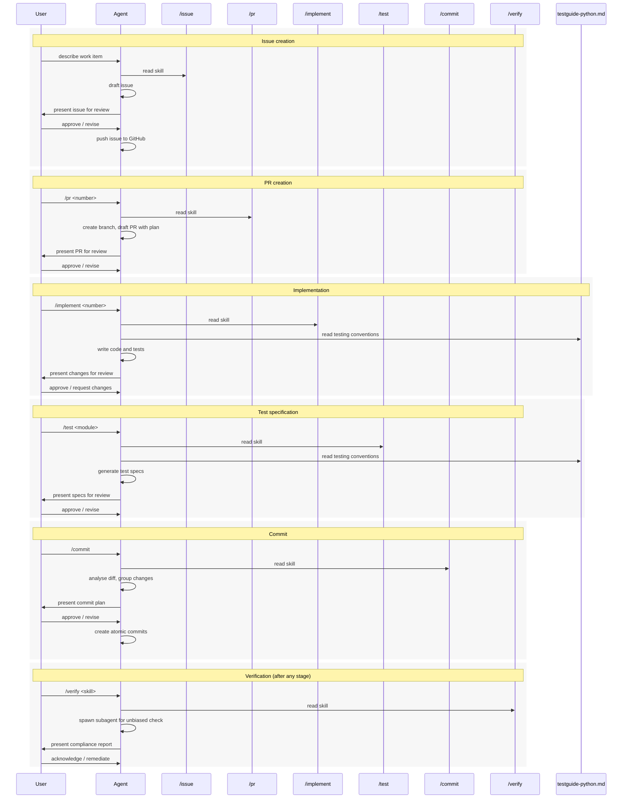

# LLM SDLC Workflow

This directory contains skill definitions and guides that form a structured software development lifecycle (SDLC) pipeline for LLM agents working on the `wool` codebase. It is the canonical source for all pipeline behaviour — the files under `.claude/skills/` are symlinks that point back here.

## Human-in-the-loop philosophy

Every skill in this pipeline is collaborative, not autonomous. The LLM agent proposes; the human disposes. Concretely:

- The agent reads a skill document, performs the described work, and presents the result to the user.
- The user reviews, approves, requests changes, or overrides any decision.
- No destructive or externally-visible action (push, PR creation, issue filing) proceeds without explicit user approval.
- The `/verify` skill exists specifically to give the user an independent compliance check after any other skill runs.

## Directory layout

```
llm/
├── README.md                          ← you are here
├── skills/
│   ├── issue.md                       ← /issue — draft and push a GitHub issue
│   ├── pr.md                          ← /pr — create a branch and draft PR from an issue
│   ├── implement.md                   ← /implement — implement a planned PR or issue
│   ├── test.md                        ← /test — generate test specifications
│   ├── commit.md                      ← /commit — stage and commit changes atomically
│   └── verify.md                      ← /verify — post-skill compliance checker
├── guides/
│   └── testguide-python.md            ← Python testing conventions (pytest, Hypothesis)
└── styles/
    └── markdown.md                    ← Markdown authoring conventions
```

## Pipeline overview

The typical development flow follows this sequence:

1. **`/issue`** — Capture the work item as a GitHub issue with acceptance criteria.
2. **`/pr`** — Create a feature branch and open a draft PR linked to the issue, including an implementation plan.
3. **`/implement`** — Execute the implementation plan: write code, guided by guides (e.g., `testguide-python.md` for test conventions).
4. **`/test`** — Generate test specifications covering public APIs of new or changed modules.
5. **`/commit`** — Stage and commit changes in disciplined, atomic commits grouped by logical kind.
6. **`/pr` (update)** — Update the draft PR description and mark it ready for review.

**`/verify`** is a cross-cutting quality gate. It can be invoked after any skill (`/verify commit`, `/verify implement`, etc.) to spawn a fresh subagent that independently checks whether the skill's requirements were met.



## Skill and guide reference

### Skills

| Skill | Invocation | Purpose |
|-------|-----------|---------|
| [issue.md](skills/issue.md) | `/issue` | Draft and push a GitHub issue. Uses `.issue.md` if present, otherwise drafts interactively. |
| [pr.md](skills/pr.md) | `/pr <number>` | Create a feature branch and draft PR from a GitHub issue, with an implementation plan in the PR body. |
| [implement.md](skills/implement.md) | `/implement <number>` | Resolve a PR or issue number to a draft PR, check out the branch, and enter plan mode to design and execute the implementation. |
| [test.md](skills/test.md) | `/test` | Generate comprehensive Given-When-Then test specifications for source modules, targeting 100% coverage of public APIs. |
| [commit.md](skills/commit.md) | `/commit` | Analyse the working tree diff, group changes by logical kind, and create disciplined atomic commits with conventional-commit messages. |
| [verify.md](skills/verify.md) | `/verify <skill>` | Spawn an independent subagent to evaluate whether a skill's MUST/SHALL requirements were met, using binary checklist decomposition. |

### Guides

| Guide | Used by | Purpose |
|-------|---------|---------|
| [testguide-python.md](guides/testguide-python.md) | `/implement`, `/test` | Python testing conventions covering pytest, pytest-asyncio, pytest-mock, and Hypothesis. Language-specific but project-agnostic. |

### Styles

The `styles/` directory contains format-specific authoring conventions (e.g., Markdown, YAML). These are **always-on context** — agents MUST read every file in `llm/styles/` at the start of a session and treat their rules as active constraints, the same way `CLAUDE.md` project instructions are treated. The directory may be empty; if so, agents SHOULD default to following established convention already present in the codebase.

## Registration mechanism

Claude Code discovers skills via the `.claude/skills/` directory. Each subdirectory there contains a `SKILL.md` symlink pointing back into `llm/skills/`:

```
.claude/skills/commit/SKILL.md    → ../../../llm/skills/commit.md
.claude/skills/implement/SKILL.md → ../../../llm/skills/implement.md
.claude/skills/issue/SKILL.md     → ../../../llm/skills/issue.md
.claude/skills/pr/SKILL.md        → ../../../llm/skills/pr.md
.claude/skills/test/SKILL.md      → ../../../llm/skills/test.md
.claude/skills/verify/SKILL.md    → ../../../llm/skills/verify.md
```

Guides are similarly symlinked where needed (e.g., `.claude/skills/implement/TESTGUIDE.md → ../../../llm/guides/testguide-python.md`). This keeps the canonical content in `llm/` while letting Claude Code's skill discovery find it automatically.
