**Wool** is a native Python package for transparently executing tasks in a horizontally scalable, distributed network of agnostic worker processes. Any picklable async function or method can be converted into a task with a simple decorator and a client connection.

## Installation

### Using pip

To install the package using pip, run the following command:

```sh
pip install --pre wool
```

### Cloning from GitHub

To install the package by cloning from GitHub, run the following commands:

```sh
git clone https://github.com/wool-labs/wool.git
cd wool
pip install ./wool
```

## Features

### Declaring tasks

Wool tasks are coroutine functions that are executed in a remote `asyncio` event loop within a worker process. To declare a task, use the `@wool.task` decorator:

```python
import wool

@wool.task
async def sample_task(x, y):
    return x + y
```

Tasks must be picklable, stateless, and idempotent. Avoid passing unpicklable objects as arguments or return values.

### Worker pools

Worker pools are responsible for executing tasks. Wool provides two types of pools:

#### Ephemeral pools

Ephemeral pools are created and destroyed within the scope of a context manager. Use `wool.pool` to declare an ephemeral pool:

```python
import asyncio, wool

@wool.task
async def sample_task(x, y):
    return x + y

async def main():
    with wool.pool():
        result = await sample_task(1, 2)
        print(f"Result: {result}")

asyncio.run(main())
```

#### Durable pools

Durable pools are started independently and persist beyond the scope of a single application. Use the `wool` CLI to manage durable pools:

```bash
wool pool up --port 5050 --authkey deadbeef --module tasks
```

Connect to a durable pool using `wool.session`:

```python
import asyncio, wool

@wool.task
async def sample_task(x, y):
    return x + y

async def main():
    with wool.session(port=5050, authkey=b"deadbeef"):
        result = await sample_task(1, 2)
        print(f"Result: {result}")

asyncio.run(main())
```

### CLI commands

Wool provides a command-line interface (CLI) for managing worker pools.

#### Start the worker pool

```sh
wool pool up --host <host> --port <port> --authkey <authkey> --breadth <breadth> --module <module>
```

- `--host`: The host address (default: `localhost`).
- `--port`: The port number (default: `0`).
- `--authkey`: The authentication key (default: `b""`).
- `--breadth`: The number of worker processes (default: number of CPU cores).
- `--module`: Python module containing Wool task definitions (optional, can be specified multiple times).

#### Stop the worker pool

```sh
wool pool down --host <host> --port <port> --authkey <authkey> --wait
```

- `--host`: The host address (default: `localhost`).
- `--port`: The port number (required).
- `--authkey`: The authentication key (default: `b""`).
- `--wait`: Wait for in-flight tasks to complete before shutting down.

#### Ping the worker pool

```sh
wool ping --host <host> --port <port> --authkey <authkey>
```

- `--host`: The host address (default: `localhost`).
- `--port`: The port number (required).
- `--authkey`: The authentication key (default: `b""`).

### Advanced usage

#### Nested pools and sessions

Wool supports nesting pools and sessions to achieve complex workflows. Tasks can be dispatched to specific pools by nesting contexts:

```python
import wool

@wool.task
async def task_a():
    await asyncio.sleep(1)

@wool.task
async def task_b():
    with wool.pool(port=5051):
        await task_a()

async def main():
    with wool.pool(port=5050):
        await task_a()
        await task_b()

asyncio.run(main())
```

In this example, `task_a` is executed by two different pools, while `task_b` is executed by the pool on port 5050.

### Best practices

#### Sizing worker pools

When configuring worker pools, it is important to balance the number of processes with the available system resources:

- **CPU-bound tasks**: Size the worker pool to match the number of CPU cores. This is the default behavior when spawning a pool.
- **I/O-bound tasks**: For workloads involving significant I/O, consider oversizing the pool slightly to maximize the system's I/O capacity utilization.
- **Mixed workloads**: Monitor memory usage and system load to avoid oversubscription, especially for memory-intensive tasks. Use profiling tools to determine the optimal pool size.

#### Defining tasks

Wool tasks are coroutine functions that execute asynchronously in a remote `asyncio` event loop. To ensure smooth execution and scalability, prioritize:

- **Picklability**: Ensure all task arguments and return values are picklable. Avoid passing unpicklable objects such as open file handles, database connections, or lambda functions.
- **Statelessness and idempotency**: Design tasks to be stateless and idempotent. Avoid relying on global variables or shared mutable state. This ensures predictable behavior and safe retries.
- **Non-blocking operations**: To achieve higher concurrency, avoid blocking calls within tasks. Use `asyncio`-compatible libraries for I/O operations.
- **Inter-process synchronization**: Use Wool's synchronization primitives (e.g., `wool.locking`) for inter-worker and inter-pool coordination. Standard `asyncio` primitives will not behave as expected in a multi-process environment.

#### Debugging and logging

- Enable detailed logging during development to trace task execution and worker pool behavior:
  ```python
  import logging
  logging.basicConfig(level=logging.DEBUG)
  ```
- Use Wool's built-in logging configuration to capture worker-specific logs.

#### Nested pools and sessions

Wool supports nesting pools and sessions to achieve complex workflows. Tasks can be dispatched to specific pools by nesting contexts. This is useful for workflows requiring task segregation or resource isolation.

Example:
```python
import asyncio, wool

@wool.task
async def task_a():
    await asyncio.sleep(1)

@wool.task
async def task_b():
    with wool.pool(port=5051):
        await task_a()

async def main():
    with wool.pool(port=5050):
        await task_a()
        await task_b()

asyncio.run(main())
```

#### Performance optimization

- Minimize the size of arguments and return values to reduce serialization overhead.
- For large datasets, consider using shared memory or passing references (e.g., file paths) instead of transferring the entire data.
- Profile tasks to identify and optimize performance bottlenecks.

#### Task cancellation

- Handle task cancellations gracefully by cleaning up resources and rolling back partial changes.
- Use `asyncio.CancelledError` to detect and respond to cancellations.

#### Error propagation

- Wool propagates exceptions raised within tasks to the caller. Use this feature to handle errors centrally in your application.

Example:
```python
try:
    result = await some_task()
except Exception as e:
    print(f"Task failed with error: {e}")
```

## Architecture

The following diagram shows the full lifecycle of a wool worker pool — from startup and discovery through task dispatch to teardown.

```mermaid
sequenceDiagram
    participant Client
    participant Routine
    participant Pool
    participant Discovery
    participant Loadbalancer
    participant Worker

    %% ── 1. Pool startup ────────────────────────────────
    rect rgb(0, 0, 0, 0)
        Note over Client, Discovery: Worker pool startup

        Client ->> Pool: create pool (size, discovery, loadbalancer)
        activate Client
        Pool ->> Pool: resolve mode from size and discovery

        opt If size specified, spawn ephemeral workers
            loop Per worker
                Pool ->> Worker: spawn worker
                Worker ->> Worker: start process, bind gRPC server
                Worker -->> Pool: worker metadata (host, port, tags)
                Pool ->> Discovery: publish "worker added"
            end
        end

        Pool ->> Pool: create proxy (discovery subscriber, loadbalancer)
        Pool -->> Client: pool ready
        deactivate Client
    end

    %% ── 2. Discovery ────────────────────────────────────
    rect rgb(0, 0, 0, 0)
        Note over Discovery, Loadbalancer: Worker discovery

        par Worker discovery
            loop Per worker lifecycle event
                Discovery -->> Loadbalancer: worker event
                activate Discovery
                alt Worker-added
                    Loadbalancer ->> Loadbalancer: add worker
                else Worker-updated
                    Loadbalancer ->> Loadbalancer: update worker
                else Worker-dropped
                    Loadbalancer ->> Loadbalancer: remove worker
                end
                deactivate Discovery
            end
        end
    end

    %% ── 3. Task dispatch ─────────────────────────────────
    rect rgb(0, 0, 0, 0)
        Note over Client, Worker: Task dispatch

        Client ->> Routine: invoke wool routine
        activate Client
        Routine ->> Routine: create task
        Routine ->> Loadbalancer: route task
        Loadbalancer ->> Loadbalancer: serialize task to protobuf

        loop Until success or all workers exhausted
            Loadbalancer ->> Loadbalancer: select next worker
            Loadbalancer ->> Worker: dispatch via gRPC
            alt Success
                Worker -->> Loadbalancer: ack
                Loadbalancer ->> Loadbalancer: break
            else Transient error
                Loadbalancer ->> Loadbalancer: continue
            else Non-transient error
                Loadbalancer ->> Loadbalancer: remove worker, continue
            end
        end
        opt All workers exhausted without success
            Loadbalancer -->> Client: raise NoWorkersAvailable
        end

        Worker ->> Worker: deserialize task, execute callable, serialize result(s)

        alt Coroutine
            Worker -->> Routine: serialized result
            Routine ->> Routine: deserialize result
            Routine -->> Client: return result
        else Async generator (bidirectional)
            loop Each iteration
                Client ->> Routine: next / send / throw
                Routine ->> Worker: iteration request [gRPC write]
                Worker ->> Worker: advance generator
                Worker -->> Routine: serialized result [gRPC read]
                Routine ->> Routine: deserialize result
                Routine -->> Client: yield result
            end
        else Exception
            Worker -->> Routine: serialized exception
            Routine ->> Routine: deserialize exception
            Routine -->> Client: re-raise exception
        end
        deactivate Client
    end

    %% ── 4. Teardown ───────────────────────────────────
    rect rgb(0, 0, 0, 0)
        Note over Client, Discovery: Worker pool teardown

        Client ->> Pool: exit pool
        activate Client

        Pool ->> Pool: stop proxy

        opt Stop ephemeral workers
            loop Per worker
                Pool ->> Discovery: publish "worker dropped"
                Discovery -->> Loadbalancer: worker event
                Loadbalancer ->> Loadbalancer: remove worker
                Pool ->> Worker: stop worker
                Worker ->> Worker: stop service, exit process
            end
        end

        Pool ->> Discovery: close discovery
        Pool -->> Client: pool exited
        deactivate Client
    end
```



## License

This project is licensed under the Apache License Version 2.0.
